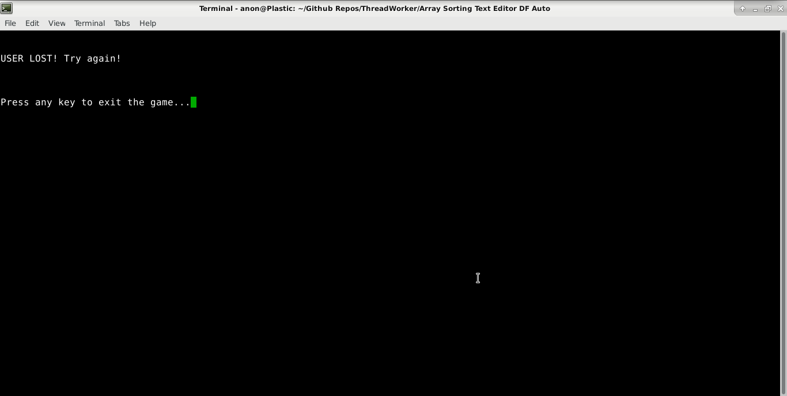

# ThreadWorker

The user can select an editor here to create their code

-------------------------------------------------------------------------------------------------

This is the building part of the game. Notice the "moves left", which are controlled
by the speedup value.
Every "tick" in the game, the user's code is ran against the unoptimized code to determine
a speedup value. 
(M)ines are denoted by M's surrounding the Mine #.
Resources can be acquired at mines.

-------------------------------------------------------------------------------------------------

New build sites were created, denoted as 'X's.
Note how the cursor is visible. It was used to create the build sites.

-------------------------------------------------------------------------------------------------

Here, the AI thread is automatically completing build tasks and
refilling its resources at the mines.
The user is much slower than the AI thread due to the user's slower reflexes.

-------------------------------------------------------------------------------------------------

The user's code was not faster here.

-------------------------------------------------------------------------------------------------

Notice the much higher speedup value above from mergesort!

# Game Description:

ThreadRacer is an optimization learning tool / game in which the user provides code to solve
a given problem (array sorting) and receives a speed boost in a 2D "building" game proportional to the
speedup that their code confers over the baseline.

The speed boost will increase movement speed, building speed, and resource acquisition speed.

The user is provided a text editor of their choice to code a solution to the sorting problem described,
with the intent being that they implement optimizations like loop unrolling, cache blocking, and common
subexpressions (whichever may be relevant for a sorting algorithm).

The 2D building game representation is run using the ncurses text display library.

The building game will dynamically resize depending on the starting window size.

The opponent will automatically pathfind to the nearest user-created build site and continue to build until they
are out of resources. They will then automatically navigate to the nearest mine to acquire more resources
until they are 'full' and can continue building.

The user's character is controlled by keyboard input (WASD)

The user will create and fulfill build site tasks until 10 are completed. 

The first thread to complete all 10 build sites wins!

# Installation (On Debian Stretch)

Installation just requires the virtual package "libncurses-dev"

	sudo apt install libncurses-dev
	
# Compiling

Compile in any of the concept subdirectories with the following command
	
	gcc main.c -lpthread -o main
	
If the above command has linker issues (may occur on some distros), use the following command
	
	gcc main.c -lpthread -lncurses -o main
	
# Running

Running the code is as easy as running the executable you created. No arguments are necessary
	
	e.g.
	
	./main
	
Follow the onscreen instructions to play the game!

#Playing
	
Controlling the thread workers requires the use of the below controls
	
	
	WASD keys to control user thread character
	
	'b' to enter (b)uild mode 
	
	Numpad 8456 keys to move build cursor
	
	'n' to create a (n)ew build site
	
	'b' to exit (b)uild mode
	
	Navigate your thread to the build sites to work on them.
	
	Navigate your thread to a (M)ine, denoted by M to refill on resources
	
The winner of the race is displayed once someone finishes all 10 build orders
	